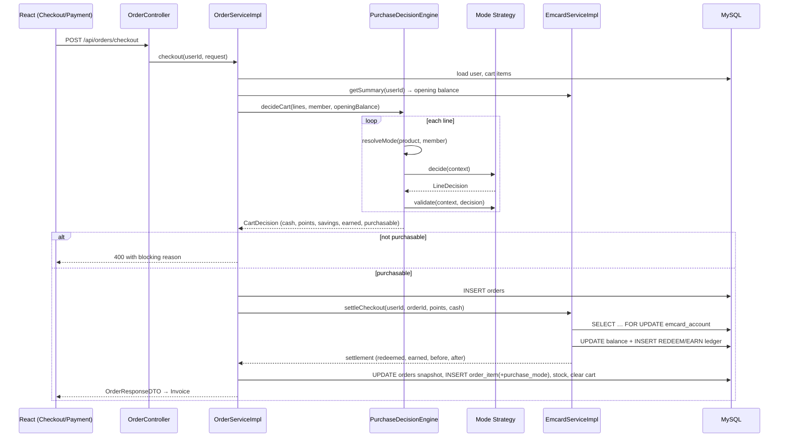
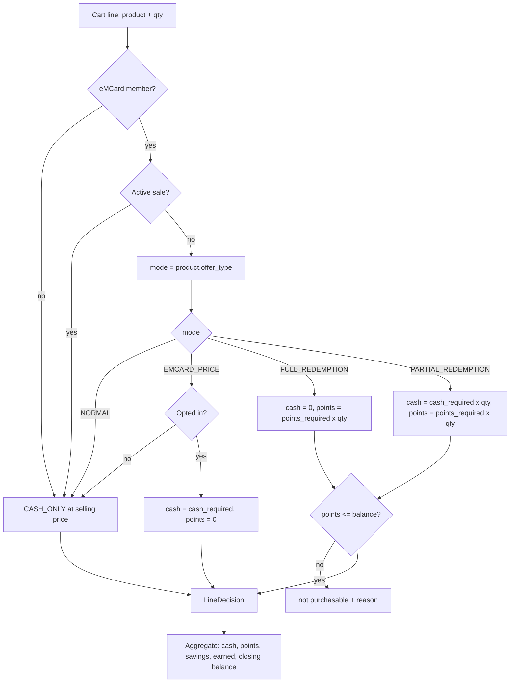
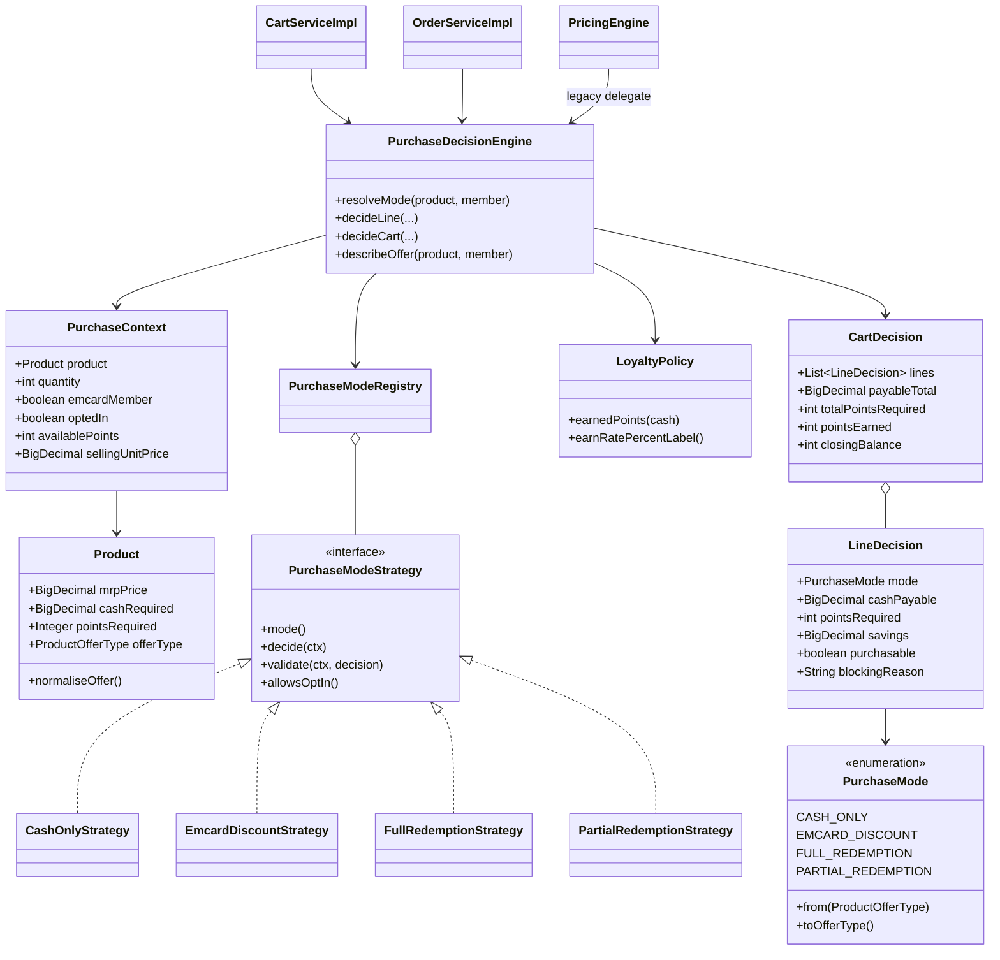

# Product Purchase Mode — Design & Implementation Analysis

> Pre-coding analysis for the "Product Purchase Mode Algorithm" requirement.
> Scope: `backend/` (Spring Boot + JPA/MySQL) and `frontend/` (React + Vite).
> Constraint: no redesign, no broken APIs, minimum schema change, full backward
> compatibility, and **no hardcoded or random rupee / e-Point values anywhere in
> business logic**.

---

## 1. Analysis of the existing Product model

`product_master` (entity `com.emart.entity.Product`) already carries almost
everything the requirement needs:

| Column | Field | Meaning today |
|---|---|---|
| `mrp_price` | `mrpPrice` | List price. Always visible to everyone. |
| `cardholder_price` | `cardholderPrice` | Legacy member cash price. Kept in sync with `cash_required`. |
| `points_to_be_redeemed` | `pointsToBeRedeemed` | Legacy point cost. Kept in sync with `points_required`. |
| `offer_type` | `offerType` (`ProductOfferType`) | **`NORMAL` / `EMCARD_PRICE` / `FULL_REDEMPTION` / `PARTIAL_REDEMPTION`** |
| `cash_required` | `cashRequired` | Cash per unit under the offer (0 for full redemption). |
| `points_required` | `pointsRequired` | Points per unit under the offer. |
| `display_type` | `displayType` (`ProductDisplayType`) | What the product page may render. |
| `on_sale`, `sale_price`, `sale_end_date` | sale fields | Public promotion, independent of eMCard. |
| `stock`, `status` | | Availability. |

Key findings:

1. **The four purchase modes already exist** as `ProductOfferType`. They map 1:1
   onto the requirement's Mode 1 / Mode 2 / Mode 3 / Mode 4.
2. `Product.normaliseOffer()` (`@PrePersist` / `@PreUpdate`) already derives
   `offerType`, `cashRequired`, `pointsRequired`, `displayType` from the legacy
   columns and writes the legacy columns back — so a product row can never hold
   a contradictory configuration, and old rows keep working.
3. `OfferTypeBackfillRunner` already classified every pre-existing row.
4. **Gap:** nothing *enforces* exactly-one-mode semantics at runtime. Mode was
   treated as advisory: the actual behaviour was driven by whether an
   `emcard_reservation` row existed (an opt-in checkbox), so
   * a `NORMAL` (cash-only) product could still have points reserved against it,
   * a `FULL_REDEMPTION` product could be bought for cash by simply not ticking
     the box,
   * a `PARTIAL_REDEMPTION` product's mandatory point component was optional,
     and the Checkout page even let the customer type an arbitrary point amount.

## 2. Analysis of the existing eMCard implementation

| Piece | Responsibility |
|---|---|
| `emcard_account` (`EmcardAccount`) | Authoritative point balance. Read with `SELECT … FOR UPDATE` (`findByUserIdForUpdate`). |
| `emcard_reservation` (`EmcardReservation`) | Pre-checkout hold, unique on `(user_id, prod_id)`. Was also abused as the "opted in" marker. |
| `emcard_txn` (`EmcardTransaction`) | Ledger: `REDEEM` / `EARN` with before/after balance. |
| `EmcardServiceImpl.reserve/release/releaseAll` | Balance-checked reserve, row-locked. |
| `EmcardServiceImpl.settleCheckout` | Permanent spend + earn inside one locked transaction; re-validates balance and throws `InsufficientPointsException` (rolls the whole checkout back); writes ledger rows; syncs the legacy `user_master.emcard_points`; clears reservations. |
| `PricingEngine` / `PricedLine` | Single line-pricing rule shared by cart and checkout. |
| `ProductVisibilityAdvice` + `ProductVisibility` | Condition 1 enforced server-side: non-members receive an MRP-only copy of every product. |
| `Orders.pointsRedeemed / pointsEarned / pointsBalanceBefore / pointsBalanceAfter` | Per-order snapshot, so an old invoice shows the figures it showed on the day. |

Strengths to keep: row locking, ledger, order-level snapshots, one pricing rule,
server-side visibility gating, `emart.loyalty.earn-rate` already externalised.

Gaps: the rule engine is a set of `if`s inside `PricingEngine`; mode is not
validated on redeem; cart/checkout do not expose per-line mode information; the
invoice text hardcodes "10%"; the sale bootstrap runner invents prices with
`java.util.Random`.

## 3. Purchase Mode design

One enum, `com.emart.service.purchase.PurchaseMode`, is the **business-facing
view** of the persisted `ProductOfferType`. Exactly one mode per product.

| Mode | Enum | Persisted `offer_type` | Cash | Points | Earns | Opt-in |
|---|---|---|---|---|---|---|
| 1 | `CASH_ONLY` | `NORMAL` | selling price | forbidden | yes | n/a |
| 2 | `EMCARD_DISCOUNT` | `EMCARD_PRICE` | `cash_required` | forbidden | yes | **member chooses** |
| 3 | `FULL_REDEMPTION` | `FULL_REDEMPTION` | 0 (must stay 0) | `points_required` | no | **member chooses** |
| 4 | `PARTIAL_REDEMPTION` | `PARTIAL_REDEMPTION` | `cash_required` | `points_required` | yes, on cash only | **member chooses** |

**Effective mode resolution** (precedence, evaluated per viewer/line):

1. Viewer is **not** an eMCard member → `CASH_ONLY` (Condition 1).
2. Product is on an **active sale** (`on_sale` and `sale_end_date` in the
   future) → `CASH_ONLY` at `sale_price`. A sale discount and an eMCard offer
   never stack; this is the same rule the Sale Banner and the "This product is
   on sale, you cannot use e-Card points on it" guard use.
3. Otherwise → `PurchaseMode.from(product.offerType)`.

**Opt-in.** Every mode that HAS an offer (2, 3 and 4) gets ONE checkbox. The
page always opens on the Regular Price, and ticking the box swaps in that
mode's terms:

* Mode 2 — ₹100, or *eMCard Price* ₹90
* Mode 3 — ₹100, or *12 e-Points, no cash to pay*
* Mode 4 — ₹100, or *₹90 + 7 e-Points*

An un-ticked box always means the same thing: pay the Regular Price, spend no
points. Once ticked, the terms themselves are **not** negotiable — the amounts
are product configuration, multiplied by quantity, and a Mode 3 line's cash
side is always exactly zero.

Mode 1 has no offer, so no row is rendered for it and
`POST /api/emcard/reserve` is rejected.

## 4. Recommended database changes

**Product: none.** `offer_type` + `cash_required` + `points_required` +
`display_type` already express the mode completely, and `normaliseOffer()`
keeps them consistent with the legacy columns.

**One additive column** — `order_item.purchase_mode VARCHAR(24) NULL`:

```sql
ALTER TABLE order_item ADD COLUMN purchase_mode VARCHAR(24) NULL;
```

Applied automatically and idempotently at startup by
`OrderItemPurchaseModeMigrationRunner` (the same statement is in
`src/main/resources/db/order-item-purchase-mode.sql` for a manual run).
This is **not** left to `ddl-auto`: the dev profile runs with
`ddl-auto=none`, so relying on Hibernate meant the column never
appeared and every checkout failed with *Unknown column 'purchase_mode'*
— after the payment had been taken.

Reason: an invoice must be mode-driven *for past orders too*. Without the
snapshot, re-opening an old order would re-derive the mode from prices — and a
product whose configuration changed later would print a different invoice than
it did on the day. Nullable, `ddl-auto=update` creates it, and old rows fall
back to derivation from the stored `(mrpPrice, unitPrice, pointsRedeemed)`
snapshot, so nothing breaks.

No other schema change is required. No table is dropped, renamed or repurposed.

## 5. Product configuration model

Everything the algorithm needs is answerable from the product row alone:

```
mode            = effective mode (§3)
sellingPrice    = sale_price while a sale is active, else mrp_price
emcardCashPrice = cash_required            (modes 2, 4)
pointsRequired  = points_required          (modes 3, 4)
savings         = sellingPrice − cashPayable
earnsPoints     = cashPayable > 0
pointsOptional  = (mode != CASH_ONLY)
displayType     = display_type
```

Invariants enforced by `normaliseOffer()` and asserted by
`PurchaseModeGuard.validateConfiguration(product)`:

* `CASH_ONLY` → `points_required = 0`, `cash_required = mrp_price`
* `EMCARD_DISCOUNT` → `points_required = 0`, `0 < cash_required < mrp_price`
* `FULL_REDEMPTION` → `cash_required = 0`, `points_required > 0`
* `PARTIAL_REDEMPTION` → `cash_required > 0`, `points_required > 0`

## 6. Central Purchase Decision Algorithm

Strategy pattern + registry. No nested `if/else` chain; adding Mode 5 means
adding one `@Component` and nothing else.

```
service/purchase/
├── PurchaseMode.java                 enum + mapping to/from ProductOfferType
├── PurchaseContext.java              product, qty, member?, optedIn?, availablePoints, resolved selling price
├── LineDecision.java                 immutable per-line result
├── CartDecision.java                 immutable aggregate result
├── PurchaseModeStrategy.java         interface: mode(), decide(ctx), validate(ctx, decision), allowsOptIn()
├── strategy/CashOnlyStrategy.java
├── strategy/EmcardDiscountStrategy.java
├── strategy/FullRedemptionStrategy.java
├── strategy/PartialRedemptionStrategy.java
├── PurchaseModeRegistry.java         Spring injects List<PurchaseModeStrategy> → EnumMap
├── LoyaltyPolicy.java                config-driven earn rate, single owner of "earn" math
└── PurchaseDecisionEngine.java       resolveMode / decideLine / decideCart / describeOffer
```

Per line the engine returns: mode, quantity, regular unit price, cash unit
price, points per unit, line cash, line savings, line points, `purchasable`,
`blockingReason`. Per cart it returns: subtotal, total cash payable, total
points required, total savings, points earned, opening balance, closing
balance, `purchasable`, `blockingReason`.

```java
LineDecision decideLine(Product p, int qty, boolean member, boolean optedIn, int availablePoints);
CartDecision decideCart(List<Line> lines, boolean member, int openingBalance);
ProductOffer describeOffer(Product p, boolean member);   // product page
```

## 7. Product Page algorithm

The backend returns the mode and every number; the frontend renders and never
infers.

```
GET /api/product/{id}/details →
  purchaseMode, purchaseModeLabel, displayType,
  price (selling), mrpPrice, emcardCashPrice, pointsRequired,
  emcardSavings, pointsOptional, earnsPoints, onSale
```

| Mode | Rendered |
|---|---|
| `CASH_ONLY` | selling price only (plus struck-through MRP + % off while on sale) |
| `EMCARD_DISCOUNT` | MRP, eMCard price, savings, **checkbox** |
| `FULL_REDEMPTION` | MRP, then "N e-Points · no cash to pay" once ticked, **checkbox** |
| `PARTIAL_REDEMPTION` | MRP, then "₹X + N e-Points" once ticked, savings, **checkbox** |

Non-members receive `CASH_ONLY` + MRP from `ProductVisibilityAdvice`, so the
member-only rows cannot leak over the wire.

## 8. Cart processing algorithm

```
openingBalance ← emcard_account.total_points (0 for non-members)
for each cart line:
      mode ← resolveMode(product, member)
      decision ← registry.forMode(mode).decide(context)
      validate(decision)                    // stock, balance, mode rules
      accumulate cash / points / savings
runningPoints check: Σ pointsRequired ≤ openingBalance   (across the whole cart)
totals: subtotal, payableTotal, totalSavings, totalPointsToRedeem,
        pointsEarned = LoyaltyPolicy.earn(payableTotal),
        closingBalance = openingBalance − totalPointsToRedeem + pointsEarned
        purchasable / blockingReason
```

Mixed carts work because every line is decided independently before any total
is computed. The point-balance check is cumulative, not per line, so two
half-affordable lines cannot both pass.

## 9. Checkout algorithm

All twelve steps run inside `OrderServiceImpl.checkout`, one `@Transactional`:

1. Load user; resolve membership.
2. Load cart items (fail fast if empty).
3. Load opening balance.
4. `decideCart(...)` — mode per line, validation per line, cumulative point check.
5. Reject with `InsufficientPointsException` / `IllegalStateException` if
   `!purchasable` (message names the product and what is missing).
6. Per line: cash payable, points required, savings — from the decision.
7. Stock check + decrement.
8. Persist `Orders` (needs an id for the ledger rows).
9. `settleCheckout(userId, orderId, totalPoints, payableTotal)`: row-locked
   re-validation, spend, earn, ledger rows, legacy balance sync, reservation
   purge.
10. Snapshot `pointsRedeemed / pointsEarned / balanceBefore / balanceAfter` on
    the order.
11. Persist order items **including `purchase_mode`**; clear the cart.
12. Generate the invoice PDF and e-mail the confirmation (failures here never
    roll back a paid order).

## 10. Loyalty calculation algorithm

`LoyaltyPolicy` is the only place that knows how points are earned:

```
earned = floor(cashActuallyPaid × emart.loyalty.earn-rate)      // default 0.10
```

| Mode | Cash | Points spent | Earned |
|---|---|---|---|
| Cash only | ₹500 | 0 | 50 |
| eMCard discount | ₹450 | 0 | 45 |
| Partial redemption | ₹180 | 120 | 18 |
| Full redemption | ₹0 | 450 | 0 |

The rate comes from configuration (`LOYALTY_EARN_RATE` env / property), never
from a literal in the logic, and the *same* object formats the "earned points
(N% of amount paid)" label shown on the invoice, so screen, PDF and ledger
cannot disagree.

## 11. Point redemption algorithm

```
reserve(userId, productId):            # Mode 2 opt-in only
    lock account
    mode ← resolveMode(product, member = true)
    if sale active            → reject "This product is on sale…"
    if mode = CASH_ONLY       → reject "…can only be purchased with cash"
    if mode ∈ {FULL, PARTIAL} and points > balance → reject (insufficient)
    else                      → 0-point reservation row = "opted in"

redeem (at checkout):
    points ← Σ line.pointsRequired          # from configuration, never from input
    lock account; assert points ≤ balance   # else roll back
    balance ← balance − points + earned
    write REDEEM / EARN ledger rows
```

The customer can no longer send an arbitrary point amount: quantity is the only
input, points come from `points_required × qty`. Negative balances are
impossible because the only decrement happens under the row lock after the
assertion.

## 12. Invoice calculation algorithm

Driven by the stored `order_item.purchase_mode` (with derivation fallback):

| Mode | Invoice lines |
|---|---|
| Cash only | price, qty, line total, earned points |
| eMCard discount | MRP, eMCard price, savings, cash paid, earned points |
| Full redemption | opening balance, points redeemed, closing balance (cash 0) |
| Partial redemption | cash paid, points redeemed, earned points, savings |

Order-level footer always shows: subtotal (MRP), total savings, payable total,
opening balance, points redeemed, points earned (label carries the configured
rate), closing balance. On-screen invoice and the OpenPDF file read the same
`OrderResponseDTO`.

## 13. Validation rules

| Rule | Where | Failure |
|---|---|---|
| Cash-only product may never redeem points | `CashOnlyStrategy`, `reserve()` | rejected, message |
| eMCard-discount product may never redeem points | `EmcardDiscountStrategy`, `reserve()` | rejected, message |
| Full redemption cash must be exactly 0 once taken | `FullRedemptionStrategy` | decision forces 0 |
| An un-taken offer (any mode) charges the regular price and 0 points | each strategy | — |
| Full/partial redemption needs sufficient points | strategy `validate` + `settleCheckout` | line not purchasable / `InsufficientPointsException` |
| Partial redemption, once opted in, requires **both** cash and points | `PartialRedemptionStrategy` | mis-configured product rejected |
| Partial redemption without the opt-in charges the regular price and 0 points | `PartialRedemptionStrategy` | — |
| Non-member may never redeem | mode resolution + `settleCheckout` | `CASH_ONLY`, or exception on a crafted request |
| Sale price and eMCard offer never stack | mode resolution + `reserve()` | `CASH_ONLY` at sale price |
| Points scale with quantity | `LineDecision` | — |
| Stock ≥ quantity | checkout | `IllegalStateException` |
| Cumulative cart points ≤ balance | `decideCart` | cart not purchasable |

## 14. Sequence diagram — checkout



## 15. Flow diagram — per-line decision



## 16. Class diagram



## 17. Edge cases

1. **Quantity scaling** — points and cash both multiply by quantity.
2. **Balance drops between cart and checkout** (another tab, admin adjustment) —
   re-validated under the row lock; whole checkout rolls back.
3. **Mixed cart** where one full-redemption line is affordable alone but not
   together with another — cumulative check catches it.
4. **Non-member with a crafted reserve/checkout request** — no account ⇒
   `CASH_ONLY` pricing, and any non-zero redemption throws.
5. **Product goes on sale while it sits in the cart** — line silently becomes
   cash-only at the sale price; points are not spent.
6. **Product reconfigured (mode changed) while in the cart** — the cart re-reads
   the product on every response, so the new mode applies before payment; the
   order stores the mode actually charged.
7. **Zero-cash order (all full redemption)** — payment gateway is skipped,
   nothing charged, points still spent, earns 0.
8. **Mis-configured product** (e.g. `PARTIAL_REDEMPTION` with 0 points) — the
   guard reports it instead of silently giving goods away.
9. **Rounding** — earned points floor; money at 2 dp, `HALF_UP`.
10. **Concurrent double checkout** — `SELECT … FOR UPDATE` serialises them; the
    second sees the reduced balance.
11. **Duplicate reserve clicks** — idempotent; unique `(user_id, prod_id)`.
12. **Stale reservations on modes 3/4 from before this change** — ignored by
    pricing (mode drives points) and purged at settlement.
13. **Out of stock** — checkout fails before any point movement.

## 18. Testing strategy

* **Unit (JUnit 5, no Spring):** every strategy in isolation, the registry, the
  engine's mode resolution, cart aggregation, `LoyaltyPolicy`, validation rules.
  These are pure objects — a `Product` POJO is all the fixture needed.
* **Regression:** the existing `PricingEngineTest` keeps running against the
  delegating `PricingEngine`, proving the legacy contract still holds.
* **Integration (documented, §20):** `@SpringBootTest` + H2 for cart → checkout
  → invoice across a mixed cart, insufficient balance, and concurrency.
* **Manual:** one product per mode; verify listing, details, cart, checkout,
  payment skip, invoice PDF, ledger rows.

## 19. Unit test cases

| # | Case | Expected |
|---|---|---|
| U1 | Cash-only, member, qty 1, MRP 500 | cash 500, points 0, earns 50 |
| U2 | Cash-only, points reserved somehow | points ignored → 0 |
| U3 | eMCard discount, not opted in | cash = MRP, points 0 |
| U4 | eMCard discount, opted in (500/450) | cash 450, savings 50, earns 45 |
| U5 | eMCard discount, opt-in by a non-member | cash = MRP |
| U6a | Full redemption, not opted in | cash 300 (regular), points 0 |
| U6 | Full redemption (MRP 300 / 450 pts), opted in, balance 450 | cash 0, points 450, earns 0, purchasable |
| U7 | Full redemption, balance 449 | not purchasable + reason |
| U8 | Full redemption qty 3, balance 1350 | points 1350, cash 0 |
| U9a | Partial (180 + 120), not opted in | cash 300 (regular), points 0 |
| U9 | Partial (180 + 120), opted in, balance 120 | cash 180, points 120, earns 18 |
| U10 | Partial qty 2, balance 200 | needs 240 → not purchasable |
| U11 | Any mode on active sale | mode collapses to cash-only at sale price |
| U12 | Non-member, full-redemption product | cash = MRP, points 0 |
| U13 | Mixed cart (all four modes) | totals = per-line sums; cumulative point check |
| U14 | Cumulative balance: two full-redemption lines, balance covers one | cart not purchasable |
| U15 | `LoyaltyPolicy` 0 / 9 / 500 cash at 10% | 0 / 0 / 50 (floor) |
| U16 | `LoyaltyPolicy` at configured 20% | doubles, no literal in logic |
| U17 | `PurchaseMode.from/toOfferType` round-trip | identity for all four |
| U18 | Registry with an unknown mode | fails fast |
| U19 | Quantity 0 or negative | clamped to 1 |
| U20 | Mis-configured partial (0 points) | configuration error reported |

## 20. Integration test cases

| # | Case | Expected |
|---|---|---|
| I1 | `GET /api/product/{id}/details` per mode | mode + display fields correct; member vs non-member differ |
| I2 | Non-member `GET /api/product/...` | no `cash_required`/`points_required` leak |
| I3 | `POST /api/emcard/reserve` on a cash-only product | `success = false`, message |
| I4 | `POST /api/emcard/reserve` on a full/partial product | accepted; cart switches to that mode's terms |
| I4b | Same call with a balance too small for one unit | rejected at the checkbox with the reason |
| I5 | `POST /api/emcard/reserve` on an on-sale product | rejected |
| I6 | Cart with all four modes | payable, points, savings, opening/closing balance correct |
| I7 | Checkout mixed cart | order + items (with `purchase_mode`), ledger `REDEEM` + `EARN`, balance updated once |
| I8 | Checkout with insufficient points | 400, nothing persisted (order, stock, points all rolled back) |
| I9 | Checkout of a pure full-redemption cart | payable 0, gateway skipped, earns 0 |
| I10 | Two concurrent checkouts, balance enough for one | one succeeds, one fails, balance never negative |
| I11 | Invoice PDF + screen for each mode | same numbers, mode-driven rows |
| I12 | Re-open an old order (no `purchase_mode`) | mode derived, invoice unchanged |
| I13 | Out-of-stock line | 400, no point movement |

## 21. Production-ready implementation plan

| Step | Change | Risk |
|---|---|---|
| 1 | New `service/purchase` package (enum, context, decisions, 4 strategies, registry, `LoyaltyPolicy`, engine) | none — additive |
| 2 | `PricingEngine` delegates to the engine; `PricedLine` untouched | low — covered by the existing test |
| 3 | `CartServiceImpl` / `OrderServiceImpl` consume the engine; membership passed in | medium — main behaviour change |
| 4 | `EmcardServiceImpl.reserve` mode guard | low |
| 5 | Additive DTO fields (cart, cart item, order, order item, product details) + `order_item.purchase_mode` | low — additive only, no field removed |
| 6 | Mode-driven PDF invoice + configured earn-rate label | low |
| 7 | Frontend renders from backend mode fields; checkbox only for Mode 2; arbitrary point input removed | medium — UI |
| 8 | Config-driven bootstrap (sale percent/count/duration, price rounding off by default); `Random` removed from pricing | low |
| 9 | JUnit tests (§19) + `mvn test` + frontend build | — |
| 10 | Rollout: deploy backend first (all API changes additive, old frontend keeps working), then frontend | — |

**How to verify locally**

```bash
cd backend  && mvnw.cmd test          # PurchaseDecisionEngineTest + PricingEngineTest
cd frontend && npm run lint && npm run build
```

Then, with one product configured per mode: check the listing card, the
product page, add all four to one cart, check the cart/checkout figures,
place the order (a points-only cart should skip the payment gateway),
and compare the on-screen invoice with the downloaded PDF.

**Backward compatibility:** no endpoint, request shape, table or column is
removed or renamed; every new response field is additive; `PricingEngine`,
`ProductOfferType`, `ProductDisplayType`, `pointsToBeRedeemed` and
`cardholderPrice` all keep their current meaning. Rollback = redeploy the
previous jar; the one new column is nullable and ignored by the old code.
